# 🎨 DIAGRAMAS Y ARQUITECTURA - PMPOS

**Fecha:** 1 de Diciembre de 2025  
**Versión:** 2.5.6

---

## 📑 ÍNDICE

1. [Arquitectura del Sistema](#arquitectura-del-sistema)
2. [Jerarquía de Componentes](#jerarquía-de-componentes)
3. [Flujo de Datos](#flujo-de-datos)
4. [Database Schema](#database-schema)
5. [Flujo de Delivery](#flujo-de-delivery)
6. [Flujo de WhatsApp Bot](#flujo-de-whatsapp-bot)
7. [Flujo de Autenticación](#flujo-de-autenticación)
8. [Flujo de Pagos](#flujo-de-pagos)

---

## Arquitectura del Sistema

### Arquitectura Actual

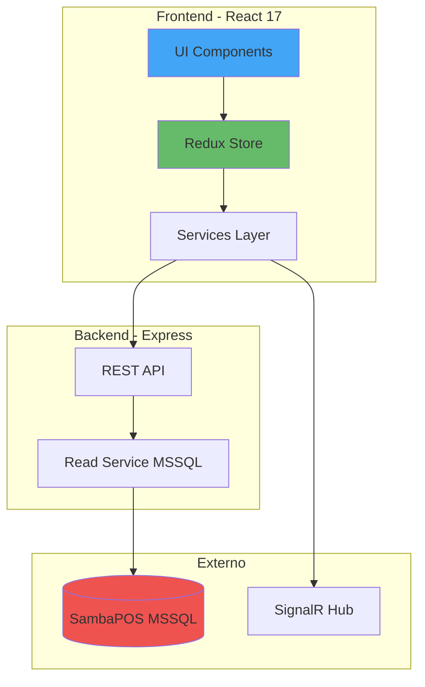

### Arquitectura Objetivo (Target)

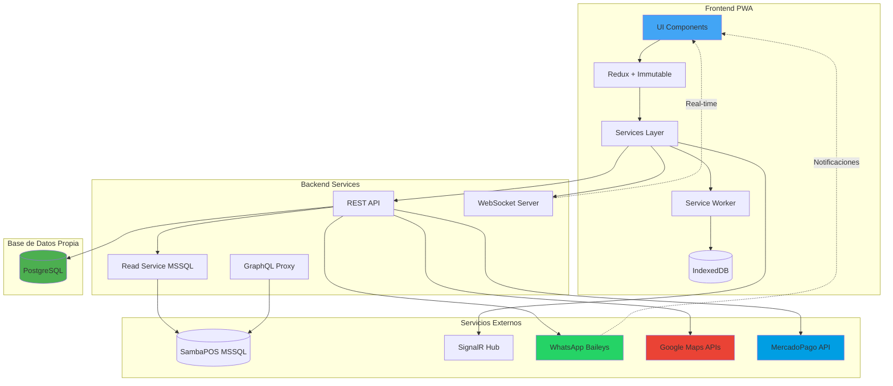

---

## Jerarquía de Componentes

### Estructura Completa de Componentes

```mermaid
graph TD
    App[App.jsx]
    
    App --> Router[React Router]
    App --> Theme[ThemeProvider]
    App --> Redux[Redux Provider]
    
    Router --> Login[Login/PinPad]
    Router --> Dashboard[SalesModeDashboard]
    Router --> Tables[TableView]
    Router --> POS[POSViewMobile]
    Router --> Admin[Admin Panel]
    Router --> Reports[Reports]
    Router --> Settings[Settings]
    Router --> PublicTracking[DeliveryTracking Público]
    
    Dashboard --> QuickSale[QuickSaleGrid]
    Dashboard --> DeliveryWizard[Delivery Wizard]
    Dashboard --> DeliveryList[Lista de Deliveries]
    
    DeliveryList --> DeliveryMap[DeliveryMapView]
    DeliveryList --> DriverAssign[DriverAssignment]
    
    Tables --> TableCard[TableCard x N]
    
    POS --> Menu[Menu]
    POS --> Cart[Cart/Orders]
    POS --> Payment[PaymentProcessor]
    
    Menu --> MenuItem[MenuItem x N]
    Menu --> Categories[Category Tabs]
    
    Payment --> CashPayment[Cash Input]
    Payment --> CardPayment[Card Input]
    Payment --> MPPayment[MercadoPago Button]
    Payment --> LoyaltyReward[Rewards Dialog]
    
    Admin --> UserMgmt[UserManagement]
    Admin --> DriverMgmt[DriverManagement]
    Admin --> ZonesEditor[DeliveryZonesEditor]
    Admin --> WhatsAppConfig[WhatsAppSettings]
    
    Settings --> GeneralSettings[General]
    Settings --> MapsSettings[Google Maps]
    Settings --> PaymentSettings[Payment Methods]
    Settings --> LoyaltySettings[Loyalty Config]
    
    Reports --> ExecutiveDash[ExecutiveDashboard]
    Reports --> SalesReports[SalesReports]
    Reports --> DeliveryMetrics[DeliveryMetrics]
    Reports --> LoyaltyDash[LoyaltyDashboard]
    
    style App fill:#1976d2
    style Dashboard fill:#42a5f5
    style POS fill:#66bb6a
    style Admin fill:#ffa726
    style Reports fill:#ab47bc
```

---

## Flujo de Datos

### Redux State Flow

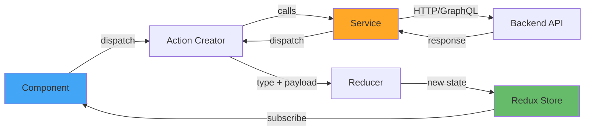

### DataManager Cache Flow

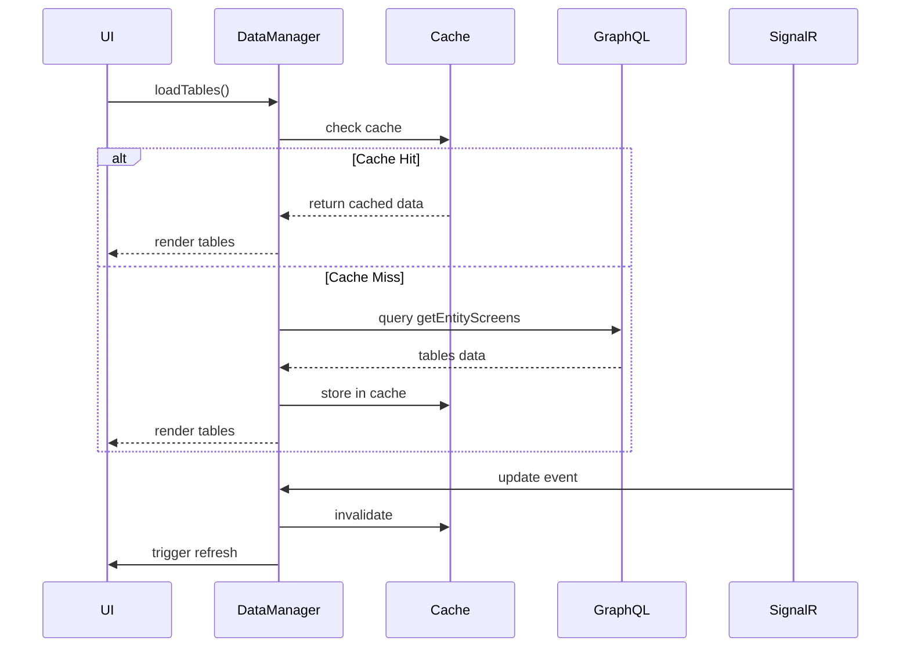

---

## Database Schema

### Schema Completo PostgreSQL

```mermaid
erDiagram
    users ||--o{ user_roles : has
    users ||--o{ shifts : opens
    users ||--o{ drivers : is
    users ||--o{ loyalty_transactions : processes
    
    roles ||--o{ user_roles : assigned_to
    roles ||--o{ role_permissions : has
    permissions ||--o{ role_permissions : belongs_to
    
    users {
        int id PK
        int sambapos_user_id
        string pin
        string name
        string email
        boolean is_active
        timestamp created_at
        timestamp updated_at
    }
    
    roles {
        int id PK
        string name
        string description
        boolean is_active
    }
    
    permissions {
        int id PK
        string resource
        string action
        string description
    }
    
    user_roles {
        int user_id FK
        int role_id FK
        timestamp assigned_at
    }
    
    role_permissions {
        int role_id FK
        int permission_id FK
    }
    
    drivers {
        int id PK
        int user_id FK
        string vehicle_type
        string plate
        boolean is_available
        point current_location
        timestamp created_at
    }
    
    shifts {
        int id PK
        int user_id FK
        timestamp opened_at
        timestamp closed_at
        decimal opening_balance
        decimal closing_balance
        decimal expected_cash
        decimal actual_cash
        decimal difference
        string notes
    }
    
    customer_loyalty ||--o{ loyalty_transactions : has
    customer_loyalty {
        int id PK
        int sambapos_entity_id FK
        int points_balance
        string tier
        timestamp joined_at
        timestamp updated_at
    }
    
    loyalty_transactions {
        int id PK
        int customer_id FK
        int ticket_id
        int points
        string type
        int processed_by FK
        timestamp created_at
    }
    
    loyalty_rewards {
        int id PK
        string name
        int points_cost
        decimal discount_amount
        string discount_type
        boolean is_active
        timestamp created_at
    }
    
    delivery_zones {
        int id PK
        string name
        jsonb polygon
        decimal fee
        int estimated_time_minutes
        boolean is_active
        timestamp created_at
    }
    
    delivery_proofs {
        int id PK
        int ticket_id
        string photo_url
        text signature_data
        point gps_location
        text notes
        timestamp created_at
    }
    
    delivery_ratings {
        int id PK
        int ticket_id
        int rating
        text comment
        timestamp created_at
    }
    
    mercadopago_payments {
        int id PK
        string payment_id
        int ticket_id
        decimal amount
        string status
        jsonb mp_response
        timestamp created_at
        timestamp updated_at
    }
    
    whatsapp_conversations {
        int id PK
        string phone_number
        int customer_id FK
        string last_message
        timestamp last_message_at
        timestamp created_at
    }
    
    whatsapp_messages {
        int id PK
        int conversation_id FK
        string message_id
        string from_number
        string to_number
        text body
        string direction
        timestamp created_at
    }
    
    whatsapp_templates {
        int id PK
        string name
        string event_type
        text template
        boolean is_active
        timestamp created_at
    }
    
    kitchen_printers {
        int id PK
        string name
        string ip_address
        int port
        string printer_type
        jsonb categories
        boolean is_active
        timestamp created_at
    }
    
    kitchen_print_jobs {
        int id PK
        int printer_id FK
        int ticket_id
        int order_id
        string status
        int retry_count
        timestamp created_at
        timestamp printed_at
    }
    
    product_images {
        int id PK
        int sambapos_menu_item_id
        string original_url
        string thumbnail_url
        string medium_url
        int size_bytes
        timestamp created_at
    }
    
    schema_migrations {
        int version PK
        string name
        timestamp executed_at
    }
```

---

## Flujo de Delivery

### Estados y Transiciones

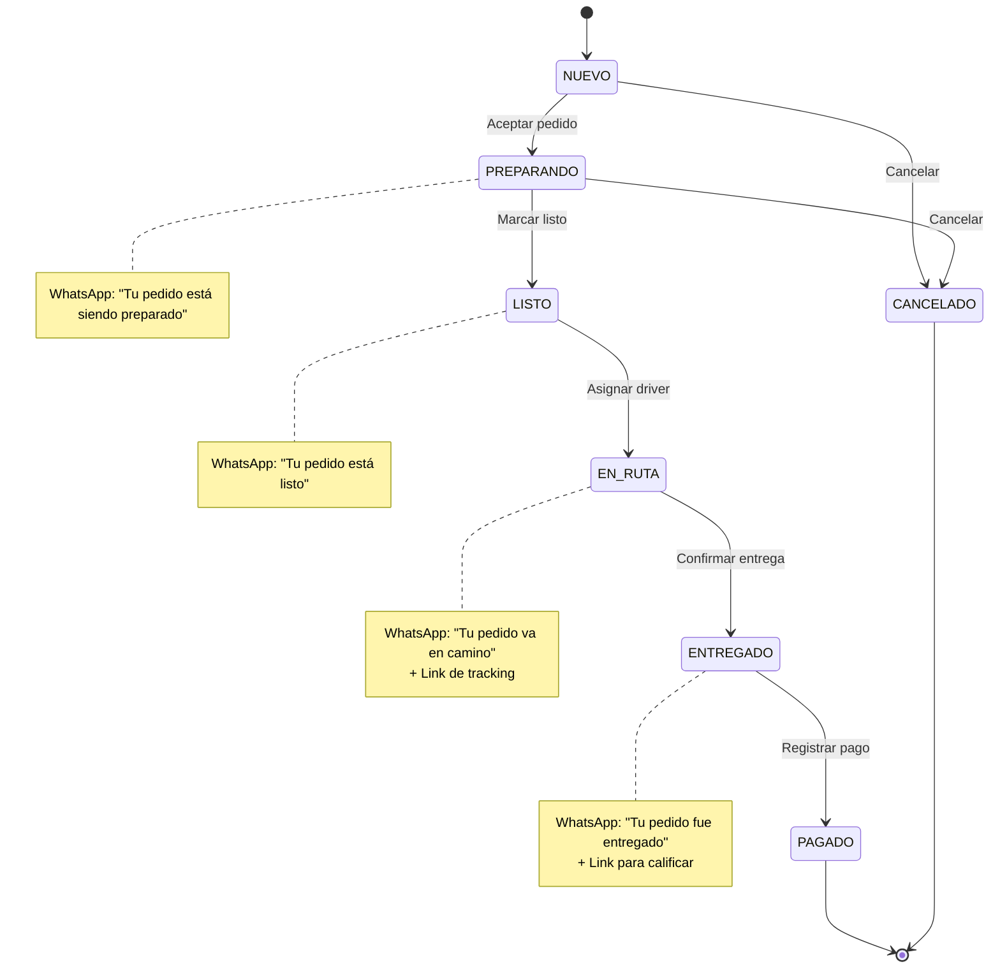

### Flujo Completo de Delivery

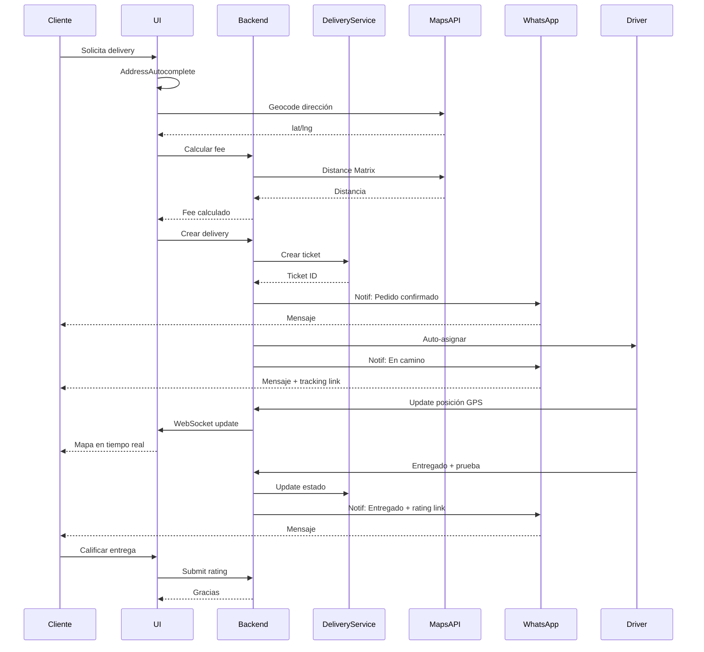

---

## Flujo de WhatsApp Bot

### Arquitectura del Bot

```mermaid
graph TB
    subgraph "WhatsApp Bot Service"
        Baileys[Baileys Client]
        Auth[Auth Handler]
        Session[Session Store]
        MsgHandler[Message Handler]
        CmdParser[Command Parser]
    end
    
    subgraph "Handlers"
        StatusCmd[/estado Handler]
        MenuCmd[/menu Handler]
        PedidoCmd[/pedido Handler]
        DefaultH[Default Handler]
    end
    
    subgraph "Notification Service"
        Templates[Template Engine]
        Queue[Send Queue]
        Retry[Retry Logic]
    end
    
    subgraph "Database"
        Conversations[(Conversations)]
        Messages[(Messages)]
        TemplatesDB[(Templates)]
    end
    
    WhatsApp[WhatsApp Servers] --> Baileys
    Baileys --> Auth
    Auth --> Session
    Baileys --> MsgHandler
    MsgHandler --> CmdParser
    
    CmdParser --> StatusCmd
    CmdParser --> MenuCmd
    CmdParser --> PedidoCmd
    CmdParser --> DefaultH
    
    StatusCmd --> Conversations
    MenuCmd --> Messages
    PedidoCmd --> Messages
    
    Templates --> TemplatesDB
    Queue --> Baileys
    Retry --> Queue
    
    DeliveryService[Delivery Service] --> Templates
    LoyaltyService[Loyalty Service] --> Templates
    OrderService[Order Service] --> Templates
    
    Templates --> Queue
    
    style Baileys fill:#25d366
    style Templates fill:#42a5f5
```

### Flujo de Comando `/estado`

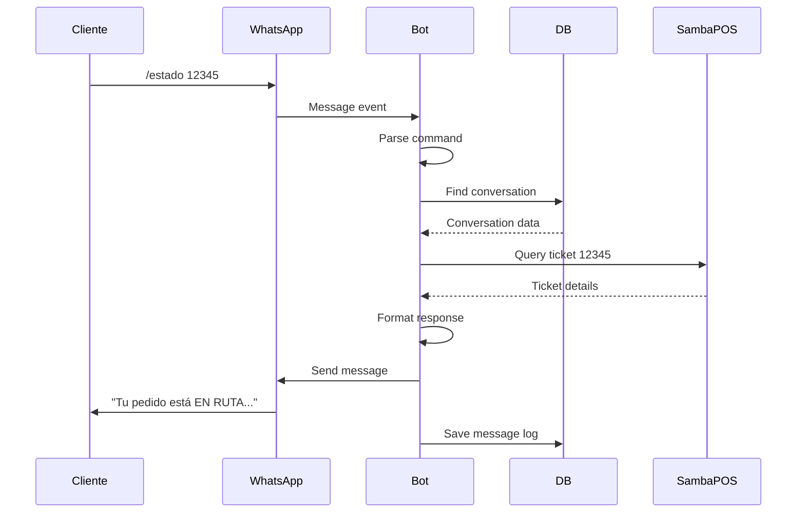

---

## Flujo de Autenticación

### Login y JWT Flow

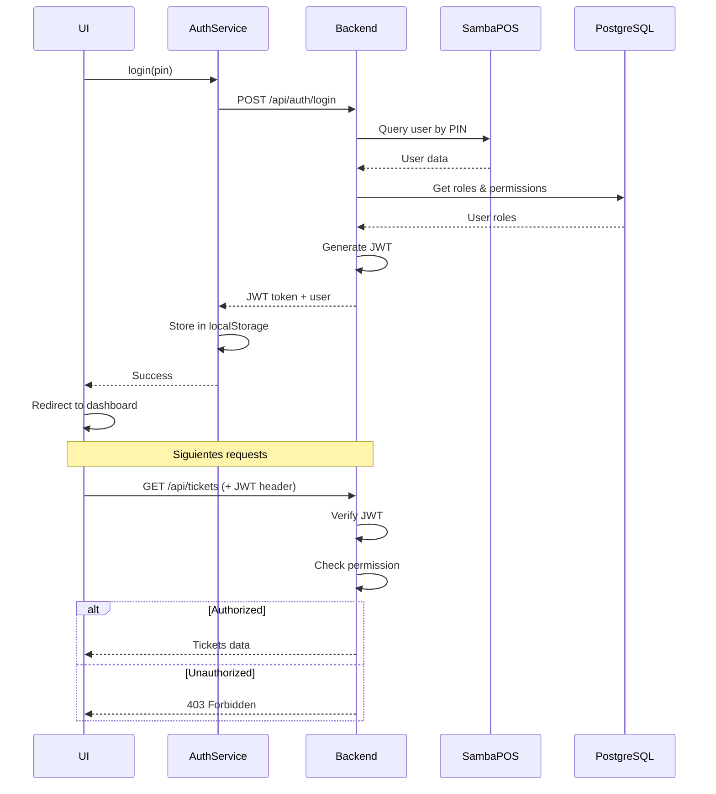

### RBAC Middleware Flow

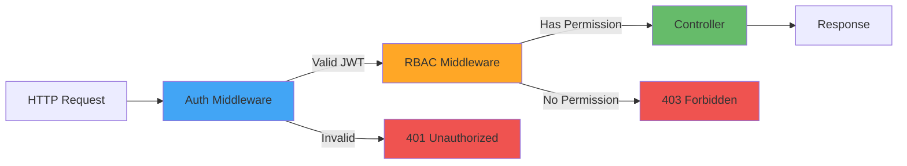

---

## Flujo de Pagos

### Payment Processing Flow

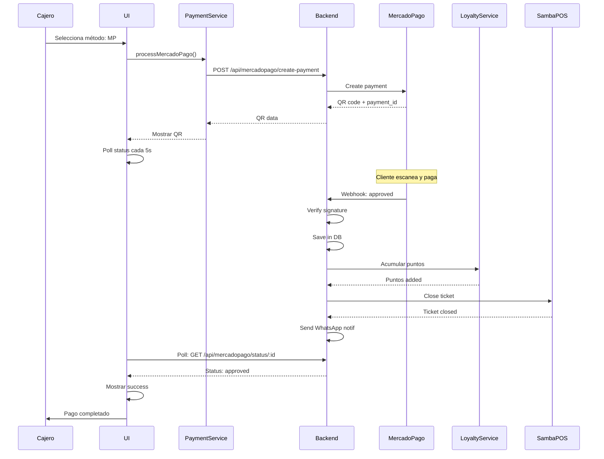

### Loyalty Points Flow

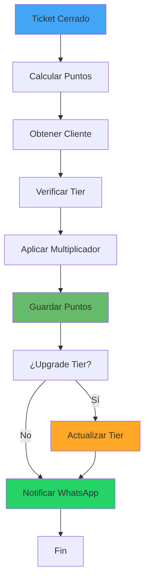

---

**Documento generado:** 1 de Diciembre de 2025  
**Próxima revisión:** Al completar Sprint 2
